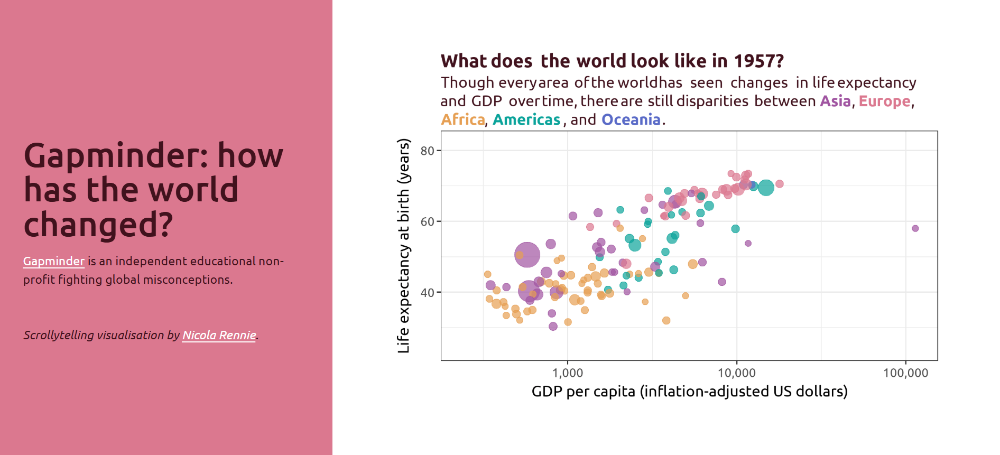

# Scrollytelling

Scrollytelling is a digital storytelling technique that uses interactive scrolling to reveal content, animations, or data in a dynamic and engaging way as the user scrolls down a webpage.

These examples are built using [Quarto](https://quarto.org/) and the [Closeread extension](https://closeread.netlify.app/). The source code can found on [GitHub](https://github.com/nrennie/scrollytelling). These visualisations are best viewed on a desktop, rather than a mobile device.

View all stories: [nrennie.rbind.io/scrollytelling](https://nrennie.rbind.io/scrollytelling/)

## [Monarchs and Marriages](https://nrennie.rbind.io/scrollytelling/posts/monarchs/)

## [Who am I?](https://nrennie.rbind.io/scrollytelling/posts/who-am-i/)

## [Gapminder: how has the world changed?](https://nrennie.rbind.io/scrollytelling/posts/gapminder/)

