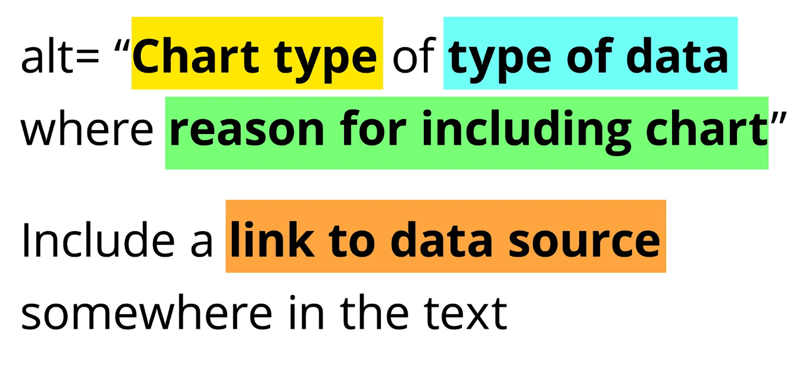

```{r}
#| file: "R/setup.R"
```

:::{.cr-section}


:::{#cr-init .scale-to-fill}

```{r}
set.seed(1234)
raw_data3 <-
  data.frame(
    x = seq(
      as.Date("01-01-2024", tryFormats = "%d-%m-%Y"),
      as.Date("01-12-2024", tryFormats = "%d-%m-%Y"),
      by = "months"
    ),
    y0 = runif(12)
  ) |>
  mutate(y1 = rnorm(12, 0, 0.5) + cumsum(y0) / max(cumsum(y0)),
         y2 = rnorm(12, 2, 0.5) + cumsum(y0) / max(cumsum(y0)),
         y3 = rnorm(12, 4, 0.5) + cumsum(y0) / max(cumsum(y0)),
         y4 = rnorm(12, 6, 0.5) + cumsum(y0) / max(cumsum(y0))) |>
  select(-y0)
colnames(raw_data3) <- c("x", paste("Statement", LETTERS[1:4]))
plot_data3 <- raw_data3 |>
  pivot_longer(
    -x,
    names_to = "category", values_to = "y"
  )

ggplot(data = plot_data3) +
  geom_line(
    mapping = aes(x = x, y = y, colour = category),
    linewidth = 3
  ) +
  PrettyCols::scale_color_pretty_d(palette = "Dark") +
  theme_classic() +
  theme(
    plot.margin = margin(15, 15, 15, 15),
    legend.position = "none",
    panel.grid = element_blank(),
    axis.text = element_blank(),
    axis.ticks = element_blank(),
    axis.title = element_blank(),
    axis.line.x = element_line(
      colour = "black", linewidth = 3,
      lineend = "round",
      arrow = arrow(
        length = unit(0.7, "cm"),
        type = "closed"
      )
    ),
    axis.line.y = element_line(
      colour = "black", linewidth = 3,
      lineend = "round",
      arrow = arrow(
        length = unit(0.7, "cm"),
        type = "closed"
      )
    ),
    plot.background = element_blank(),
    panel.background = element_blank(),
  )
```

:::


:::{focus-on="cr-init"}

# How to create a more accessible line chart

The default settings for chart software are not guaranteed to be accessible, and often need to be adapted for your own chart. Let's transform a line chart to make it more accessible.

<br><br>

*Scrollytelling visualisation by [Nicola Rennie](https://nrennie.rbind.io/).*

:::


:::{#cr-v1 .scale-to-fill}

```{r}
g0 <- ggplot(
  data = plot_data,
  mapping = aes(x = x, y = y, colour = category)
) +
  geom_line()
g0
```


:::


:::{focus-on="cr-v1"}

## Default `ggplot2` chart

The first thing that jumps out in the default chart, is how thin the lines are and how that makes them quite difficult to see. The default font size is also quite small.

<br><br>
**Increase the line width and font size.**


:::


:::{#cr-v2 .scale-to-fill}

```{r}
g <- ggplot(
  data = plot_data,
  mapping = aes(x = x, y = y, colour = category)
) +
  geom_line(linewidth = 2) +
  theme_grey(base_size = 14)
g
```


:::


:::{focus-on="cr-v2"}

## Colours

Ideally, we want the line colours to be distinguishable from each other, and also from the background.

<br><br>
**Check colour contrast in greyscale.**

:::


:::{#cr-v2b .scale-to-fill}

```{r}
des <- function(c) colorspace::desaturate(c, severity = 1)
g_des <- colorblindr:::edit_colors(g, des)
plot(g_des)
```


:::


:::{focus-on="cr-v2b"}

Since all of the default colours are equally bright, in greyscale they look identical and there’s no way to tell apart the lines.

<br><br>
**Replace default colours with more accessible palette.**

:::


:::{#cr-v3 .scale-to-fill}

```{r}
g <- g + 
  scale_colour_manual(values = okabeito) +
  theme_minimal(base_size = 14)
g
```


:::


:::{focus-on="cr-v3"}

## Don't rely on colour

Regardless of how well chosen you think your colours are, it’s important never to rely on them as the only method of distinguishing groups. 

<br><br>
**Add direct labels to the end of lines.**

:::


:::{#cr-v4 .scale-to-fill}

```{r}
g <- g +
  geom_point(
    data = slice_max(plot_data, x),
    size = 4
  ) +
  new_scale_colour() +
  scale_colour_manual(values = new_palette) +
  geom_text(
    data = slice_max(plot_data, x),
    mapping = aes(label = category, colour = category),
    hjust = -0.1,
    size.unit = "pt",
    size = 14
  ) +
  scale_x_date(
    date_labels = "%b",
    breaks = seq(
      as.Date("01-01-2024", tryFormats = "%d-%m-%Y"),
      length.out = 4,
      by = "3 months"
    ),
    limits = c(
      as.Date("01-01-2024", tryFormats = "%d-%m-%Y"),
      as.Date("01-02-2025", tryFormats = "%d-%m-%Y")
    )
  ) +
  theme(legend.position = "none")
g
```


:::


:::{focus-on="cr-v4"}

Depending on the data, direct labels may not be sufficient. 

<br><br>
**Ensure you actually visually inspect your chart.**

:::


:::{#cr-v5 .scale-to-fill}

```{r}
g2 <- ggplot(
  data = plot_data2,
  mapping = aes(x = x, y = y, colour = category)
) +
  geom_line(linewidth = 2) +
  scale_colour_manual(values = okabeito, guide = "none") +
  scale_x_date(
    date_labels = "%b",
    breaks = seq(
      as.Date("01-01-2024", tryFormats = "%d-%m-%Y"),
      length.out = 4,
      by = "3 months"
    ),
    limits = c(
      as.Date("01-01-2024", tryFormats = "%d-%m-%Y"),
      as.Date("04-02-2025", tryFormats = "%d-%m-%Y")
    )
  ) +
  theme_minimal(base_size = 14) +
  theme(legend.position = "none")
g2 +
  geom_point(
    data = slice_max(plot_data2, x),
    size = 4
  ) +
  new_scale_colour() +
  scale_colour_manual(values = new_palette, guide = "none") +
  geom_text(
    data = slice_max(plot_data2, x),
    mapping = aes(label = category, colour = category),
    hjust = -0.1,
    size.unit = "pt",
    size = 14
  )
```


:::


:::{focus-on="cr-v5"}

Regardless of how well you can distinguish colours, it’s really hard to distinguish the lines from each other here.

<br><br>
**Consider additional ways to distinguish categories, like symbols.**

:::


:::{#cr-v6 .scale-to-fill}

```{r}
g2 +
  geom_text(
    data = slice_max(plot_data2, x),
    mapping = aes(label = category, colour = category),
    hjust = -0.1,
    size.unit = "pt",
    size = 14
  ) +
  new_scale_colour() +
  scale_colour_manual(values = new_palette) +
  geom_point(
    mapping = aes(shape = category, colour = category),
    size = 6
  ) +
  theme(
    legend.position = "bottom",
    legend.title = element_blank()
  )
```


:::


:::{focus-on="cr-v6"}

It’s might be more accessible in terms of distinguishing categories but it’s actually less accessible in terms of how easy it is to read and interpret. With a quick glance, how easy is it to see which line(s) are increasing? Not very.

<br><br>
**Consider a different chart type.**

:::


:::{#cr-v7 .scale-to-fill}

```{r}
g2 + facet_wrap(~category) +
  gghighlight(use_direct_label = FALSE) +
  scale_x_date(
    date_labels = "%b",
    breaks = seq(
      as.Date("01-01-2024", tryFormats = "%d-%m-%Y"),
      length.out = 4,
      by = "3 months"
    ),
    limits = c(
      as.Date("01-01-2024", tryFormats = "%d-%m-%Y"),
      as.Date("15-12-2024", tryFormats = "%d-%m-%Y")
    )
  ) +
  theme(axis.title = element_blank())
```


:::


:::{focus-on="cr-v7"}

## Change the chart type

A good alternative to *spaghetti* line charts is small multiple line charts.

<br><br>
**Highlight one category at a time.**

:::


:::{#cr-v8 .scale-to-fill}

```{r}
g2 <- g2 + facet_wrap(~category) +
  scale_colour_manual(values = rep("#91171F", 5)) +
  gghighlight(use_direct_label = FALSE) +
  scale_x_date(
    date_labels = "%b",
    breaks = seq(
      as.Date("01-01-2024", tryFormats = "%d-%m-%Y"),
      length.out = 4,
      by = "3 months"
    ),
    limits = c(
      as.Date("01-01-2024", tryFormats = "%d-%m-%Y"),
      as.Date("15-12-2024", tryFormats = "%d-%m-%Y")
    )
  ) +
  theme(axis.title = element_blank())
g2
```


:::


:::{focus-on="cr-v8"}

Since the categories are on separately labelled charts, there’s no need for colours (or symbols) to differentiate.

<br><br>
**Use colour for highlighting, not decoration.**

:::


:::{#cr-v9 .scale-to-fill}

```{r}
g2_final <- g2 + labs(
  title = "Agreement with statement D increased during 2024",
  subtitle = "Percentage of people agreeing",
  x = NULL, y = NULL,
  caption = "Source: Data simulated from a Uniform distribution"
) +
  scale_y_continuous(
    limits = c(0, 1),
    labels = scales::label_percent()
  ) +
  theme(
    plot.title = element_textbox_simple(face = "bold"),
    plot.subtitle = element_text(colour = "grey50", margin = margin(t = 5, b = 5)),
    plot.caption = element_text(hjust = 0, colour = "grey50"),
    plot.title.position = "plot",
    plot.caption.position = "plot",
    axis.title = element_blank()
  )
g2_final
```


:::


:::{focus-on="cr-v9"}

## Make use of chart text

The title should describe the main trend in the chart. Users are more likely to understand and remember the main trend from a chart where it is also in the chart title.

<br><br>
**Use narrative titles to summarise the chart.**

:::


:::{#cr-v10 .scale-to-fill}

{fig-alt="A screenshot from the alt text which sats that is should include the chart type, type of data, the reason for including the chart, and a link to the data source"}


:::


:::{focus-on="cr-v10"}

## Chart alternatives

When producing a chart, make sure you include alt text describing the chart. Alt text is read out by screen readers or used in place of an image if internet connection is poor. Amy Cesal’s advice for [Writing Alt Text for Data Visualization](https://medium.com/nightingale/writing-alt-text-for-data-visualization-2a218ef43f81) is especially useful.

<br><br>
**Include alt text and data downloads.**

:::


:::{#cr-final .scale-to-fill}

```{r}
#| layout-ncol: 2
ggplot(
  data = plot_data2,
  mapping = aes(x = x, y = y, colour = category)
) +
  geom_line()
  
  
g2_final
```


:::


:::{focus-on="cr-final"}

The transformed version is much easier to read, more accessible, and more aesthetically pleasing.

There’s isn’t an easy, formulaic way of designing the best and most accessible chart based solely on what type of data you have. And there isn’t a chart that is the best and most accessible chart for everyone because different people have different needs.

<br><br>
**Remember**: If you’re designing things for humans, one of the best things you can do is go and talk to those humans about what they need.
 


:::

:::


