:::{.cr-section}

:::{#cr-main-plot scale-by=".95"}

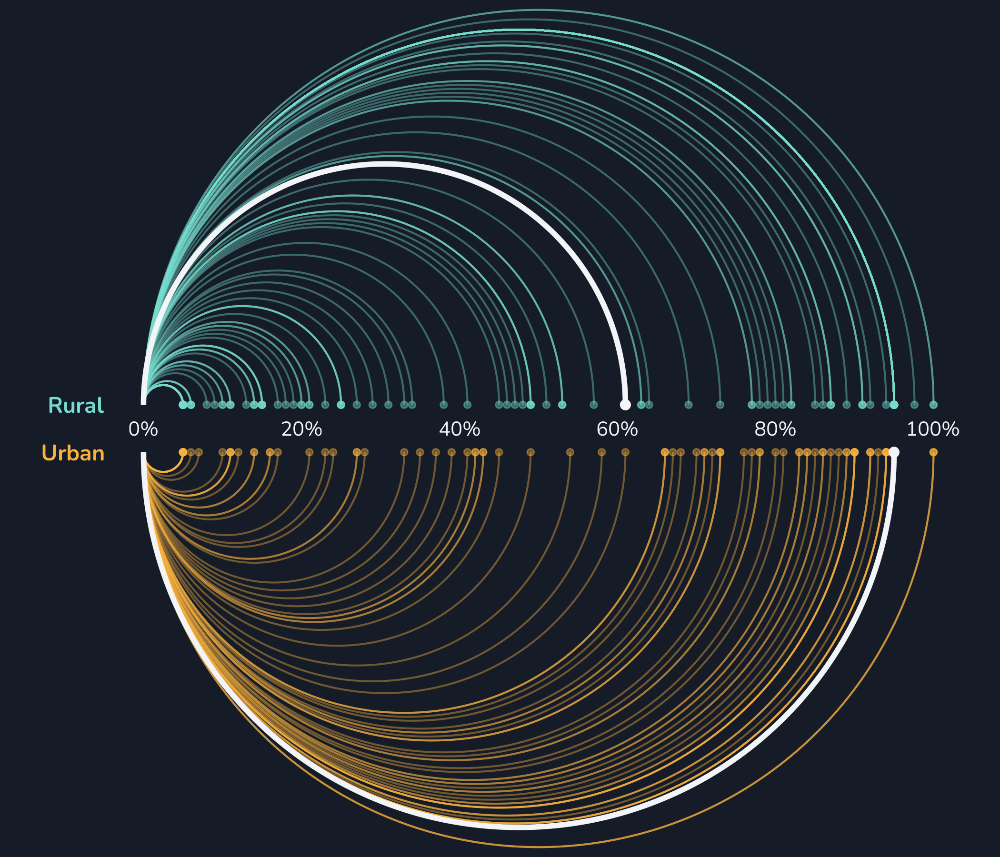

:::

:::{focus-on="cr-main-plot"}

# Sustainable energy for all

  

*Data from the [SE4ALL Database via TidyTuesday](https://github.com/rfordatascience/tidytuesday/blob/main/data/2026/2026-05-26/readme.md).*

  

*Scrollytelling visualisation by [Nicola Rennie](https://nrennie.rbind.io/).*

:::

:::{focus-on="cr-main-plot"}

The *Sustainable Energy for all (SE4ALL)* initiative, launched in 2010 by the UN Secretary General, established three global objectives to be accomplished by 2030: to ensure universal access to modern energy services, to double the global rate of improvement in global energy efficiency, and to double the share of renewable energy in the global energy mix.
  
The data used in these examples is from 2010.

:::

:::{#cr-how-to1 scale-by=".95"}

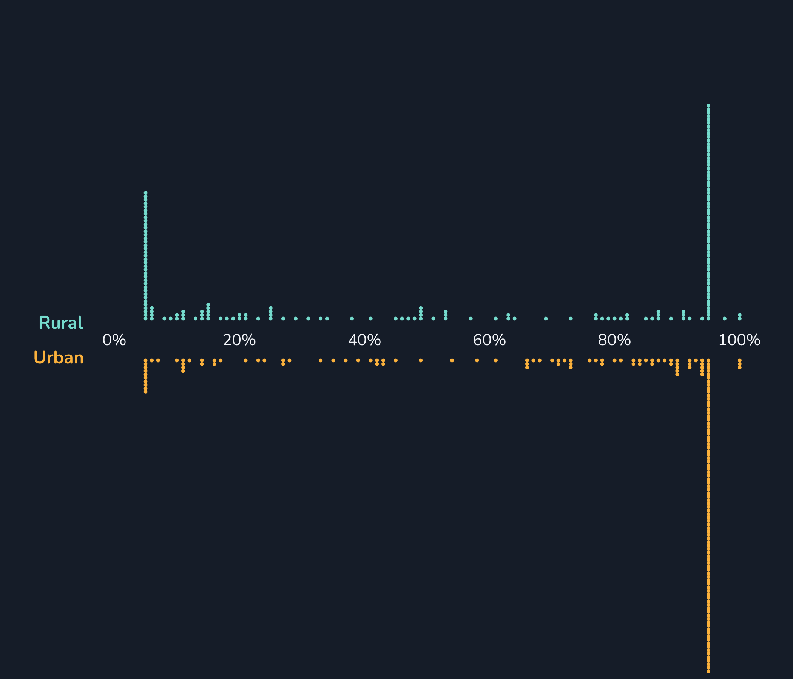

:::

:::{focus-on="cr-how-to1"}

## How to read this chart

Each dot represents a different country. It shows the percentage of the population in urban and rural areas with access to non-solid fuel like natural gas, LPG, electricity, and ethanol.
  
Many countries have the same value of 5% or 95%.

:::

:::{#cr-how-to2 scale-by=".95"}

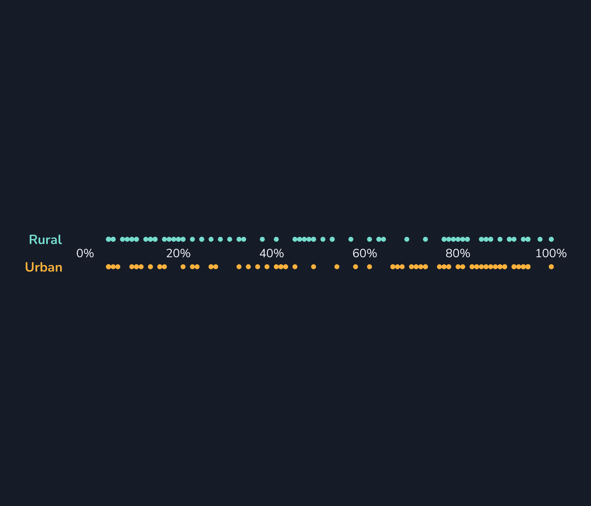

:::

:::{focus-on="cr-how-to2"}

Many values equal to the same round number can be suspicious. We may choose to collapse the stacked points down. 

:::

:::{#cr-how-to3 scale-by=".95"}

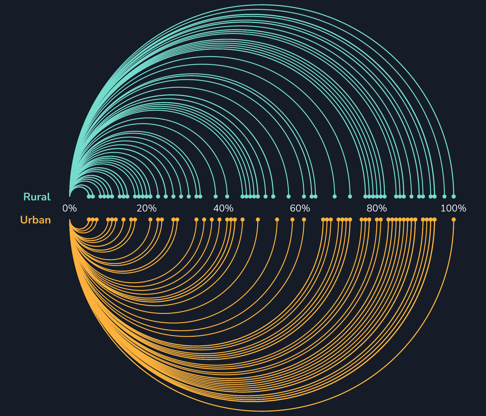

:::

:::{focus-on="cr-how-to3"}

The diameter of the arcs represents the percentage of the population with access to non-solid fuels, i.e., the same as the x-axis values.

:::

:::{#cr-how-to4 scale-by=".95"}

:::

:::{focus-on="cr-how-to4"}

Making the lines semi-transparent helps to see where there are more countries with the same value.
  
The white lines show the median across all countries included in the dataset.

:::

:::{#cr-rural scale-by=".95"}

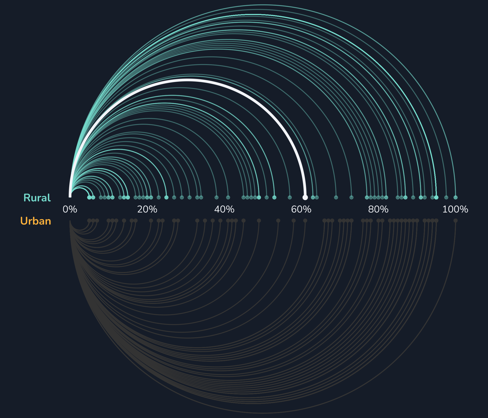

:::

:::{focus-on="cr-rural"}

## Rural areas

The median percentage of the population with access to non-solid fuels in rural areas is **61%**.

:::

:::{#cr-min-rural scale-by=".95"}

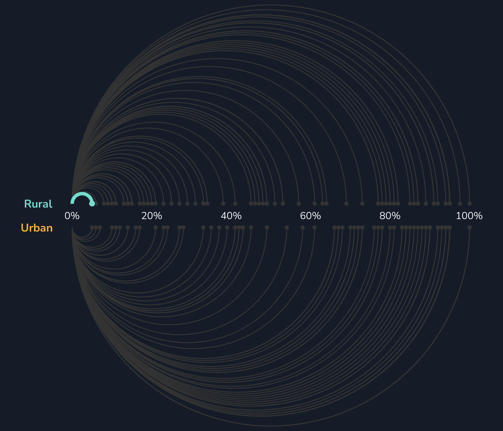

:::

:::{focus-on="cr-min-rural"}

37 countries (including **Afghanistan, Bangladesh, Benin, Burkina Faso, Burundi, Cambodia, Cameroon, Central African Republic, Congo, Dem. Rep., Congo, Rep., Cote d'Ivoire, Ethiopia, Gambia, The, Ghana, Guinea, Guinea-Bissau, Haiti, Kenya, Korea, Dem. Rep., Lao PDR, Liberia, Madagascar, Malawi, Mali, Mongolia, Mozambique, Myanmar, Niger, Rwanda, Sierra Leone, Solomon Islands, Somalia, Tanzania, Timor-Leste, Togo, Uganda, and Zambia**) had the minimum percentage with just **5%** of the rural population able to access non-solid fuels.

:::

:::{#cr-max-rural scale-by=".95"}

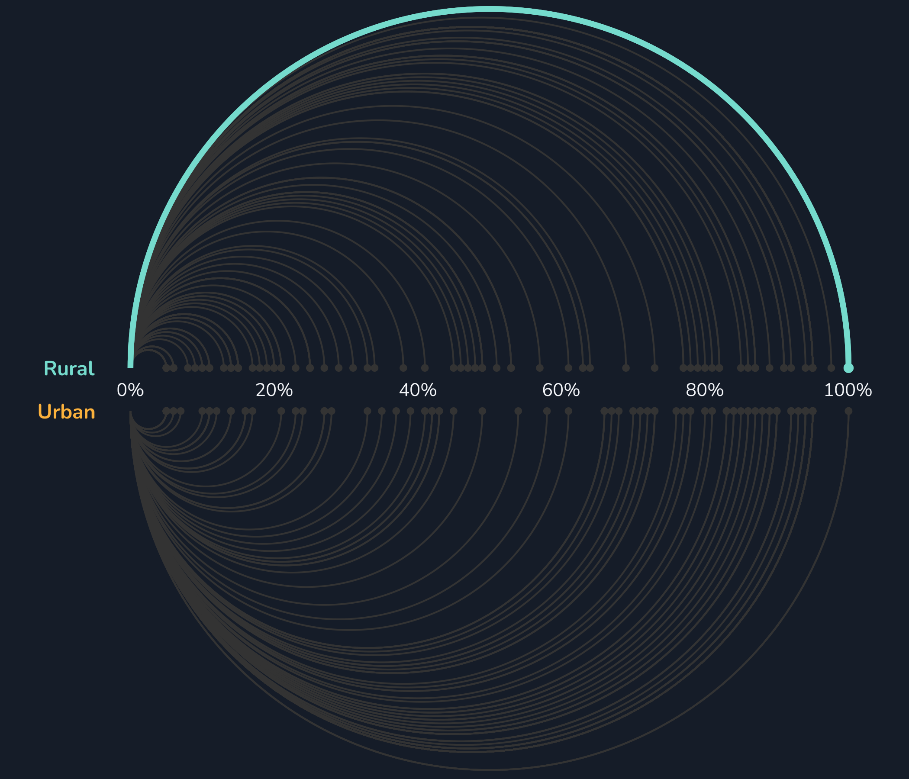

:::

:::{focus-on="cr-max-rural"}

Two countries (**Grenada and St. Lucia**) had the maximum percentage with **100%** of the rural population able to access non-solid fuels.

:::

:::{#cr-urban scale-by=".95"}

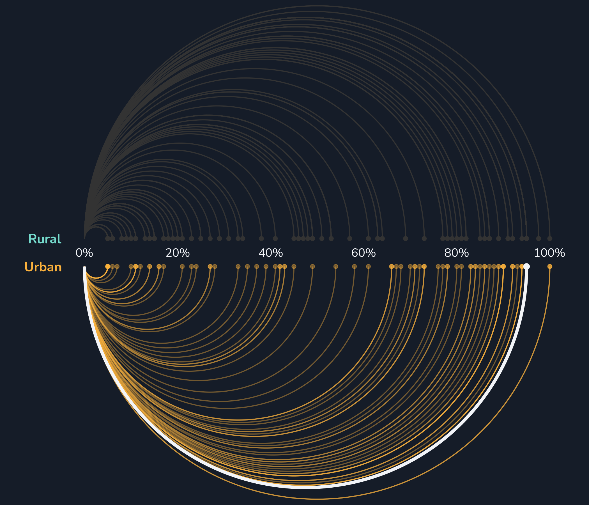

:::

:::{focus-on="cr-urban"}

## Urban areas

The median percentage of the population with access to non-solid fuels in urban areas is **95%**.

:::

:::{#cr-min-urban scale-by=".95"}

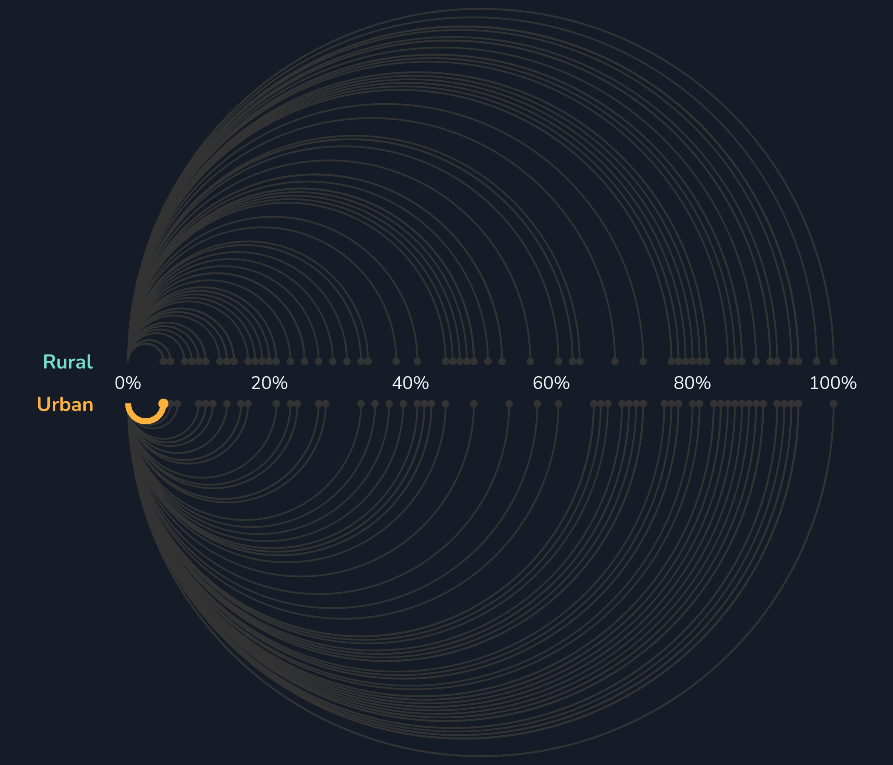

:::

:::{focus-on="cr-min-urban"}

10 countries (including **Burundi, Central African Republic, Guinea, Guinea-Bissau, Liberia, Madagascar, Mali, Rwanda, Sierra Leone, and Somalia**) had the minimum percentage with just **5%** of the urban population able to access non-solid fuels.

:::

:::{#cr-max-urban scale-by=".95"}

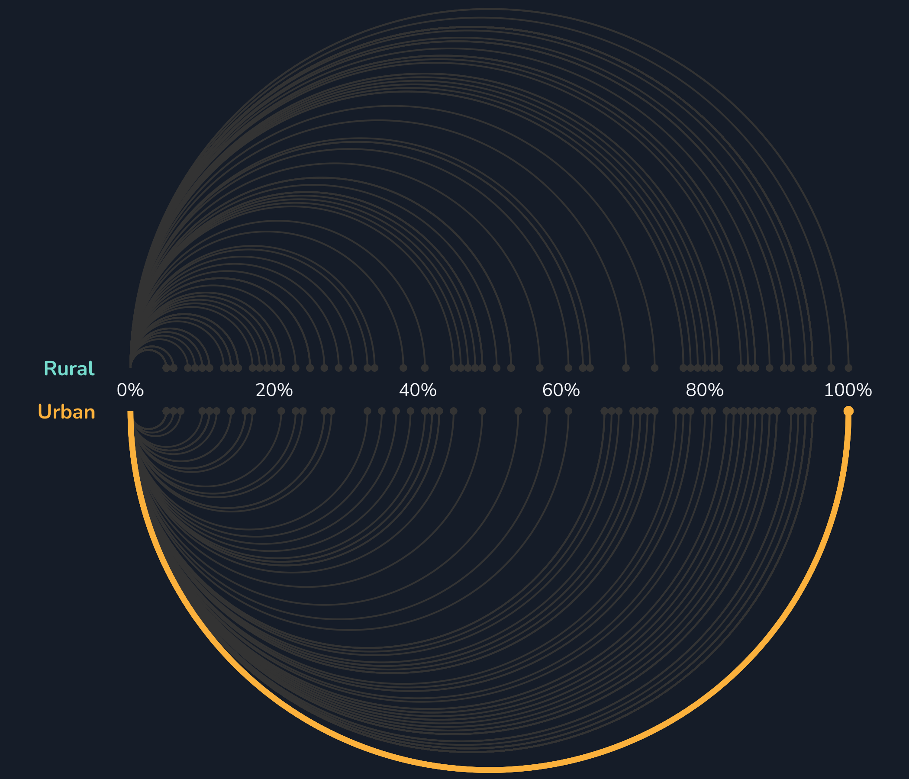

:::

:::{focus-on="cr-max-urban"}

As with rural areas, **Grenada and St. Lucia** had the maximum percentage with **100%** of the urban population able to access non-solid fuels.

:::

:::{#cr-biggest-diff scale-by=".95"}

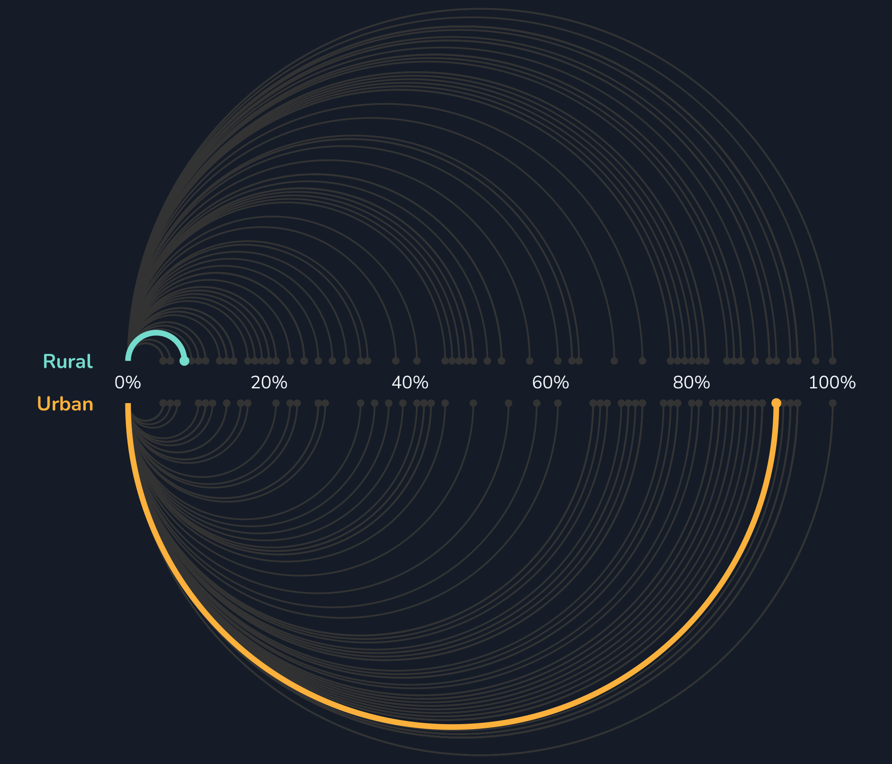

:::

:::{focus-on="cr-biggest-diff"}

## Biggest difference

The **Marshall Islands** had the biggest difference between urban (92%) and rural (8%) areas.

No areas had higher access in rural areas.

:::

:::{focus-on="cr-main-plot" scale-by=".95"}

 

 [nrennie.rbind.io](https://nrennie.rbind.io/)

 

 [nicola-rennie](https://www.linkedin.com/in/nicola-rennie/)

 

 [nrennie](https://github.com/nrennie)

:::

:::
